# job4j_todo

This application is task list website. Users can post, view, edit, mark as done or delete tasks. Also users can switch
between all, new or finished tasks. Each user sees only their own tasks. The task's creation time is displayed according
to the user's time zone.

# Used technologies

Implemented with:
<ul>
 <li>JDK 17</li>
 <li>Maven 3.8.5</li>
 <li>Lombok 1.18.22</li>
 <li>Spring Boot 2.7.3</li>
 <li>Bootstrap 4.4.1</li>
 <li>Thymeleaf 2.7.3</li>
 <li>JDBC 4</li>
 <li>Hibernate 5.6.11.Final</li>
 <li>PostgreSQL 42.2.9</li>
 <li>Liquibase 4.15.0</li>
</ul>

# Environment requirements

<ul>
 <li>Create db "todo". Login: postgres, password: password</li>
 <li>Create .jar file via maven command "mvn package"</li>
 <li>Go to the Target folder and check the presence of "job4j_todo-1.0-SNAPSHOT.jar" file</li>
 <li>Open the command line, go to the Target folder</li>
 <li>Run this file through "java -jar job4j_todo-1.0-SNAPSHOT.jar" command</li>
 <li>Then go to the "http://localhost:8080/index" page</li>
</ul>

# Screenshots

- Sign up page:
  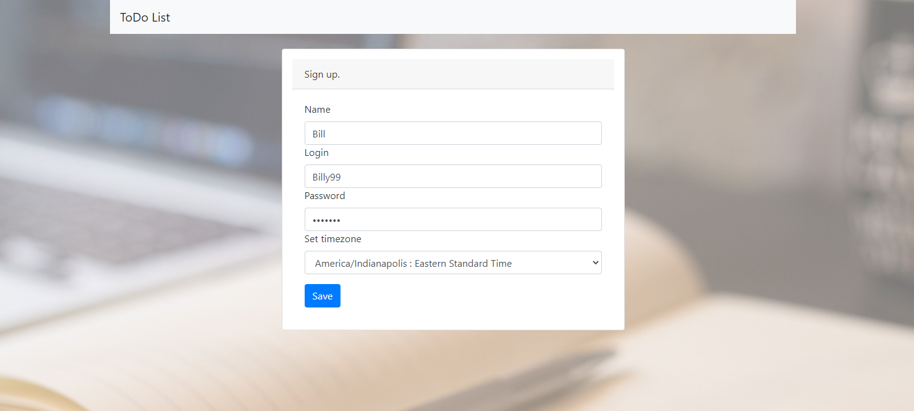
- Successful sign up message:
  
- Failed sign up message:
  
- Log in page:
  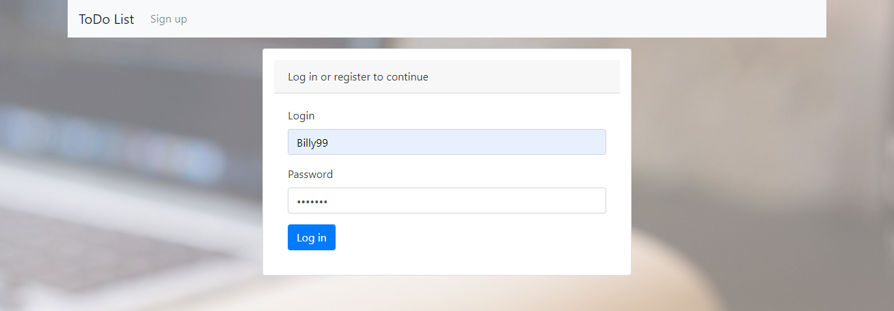
- Failed log in message:
  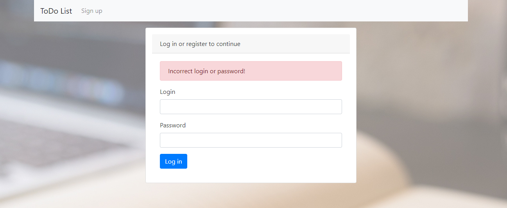
- Index page:
  
- All tasks page:
  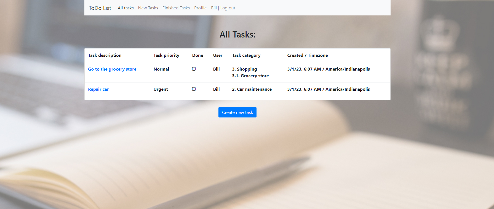
- New task adding:
  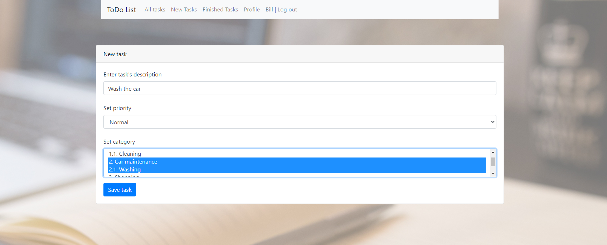
- Task showing page:
  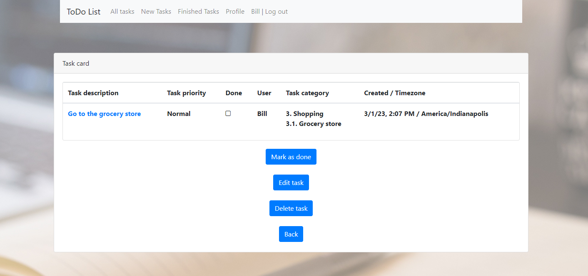
- All tasks view after mark one task as done:
  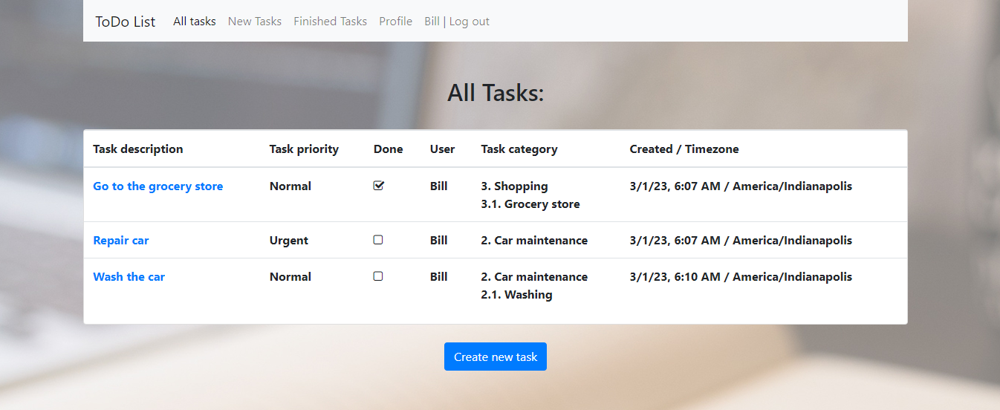
- Task editing page:
  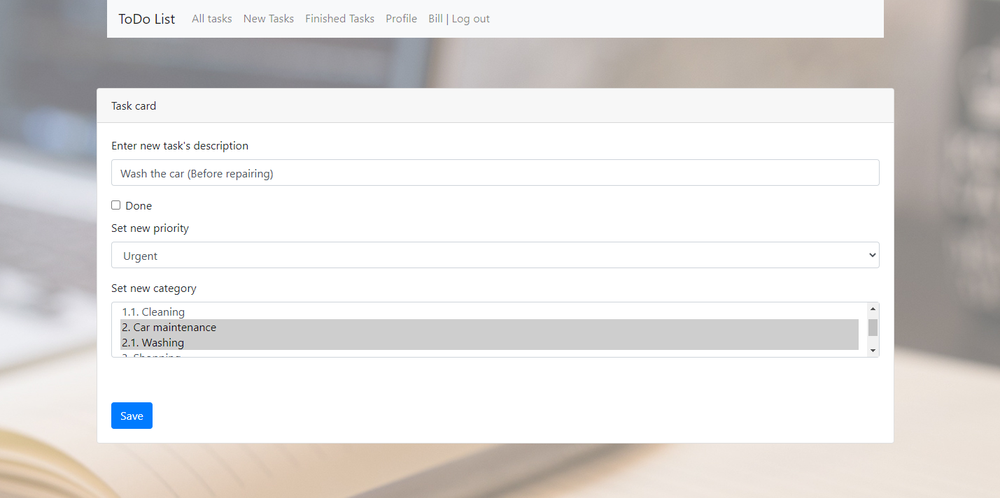
- New tasks page:
  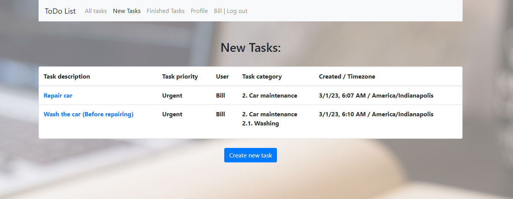
- Finished tasks page:
  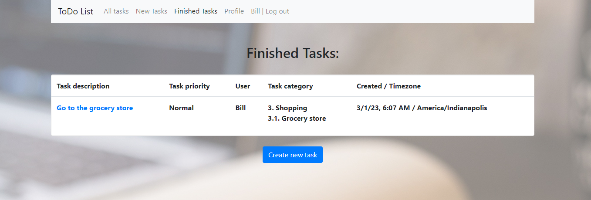
- User profile:
  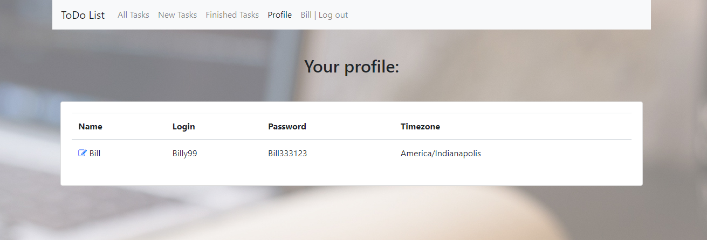
- User profile editing:
  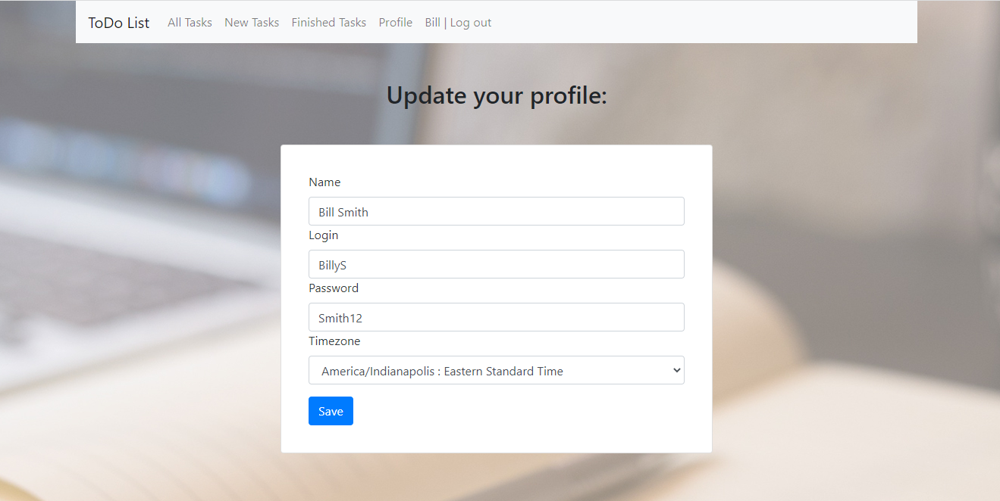
- All tasks view by another user:
  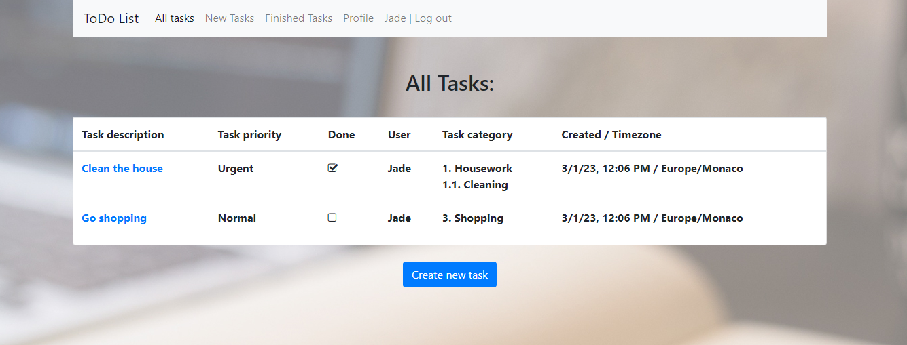

Contact me: itfedorovsa@gmail.com

